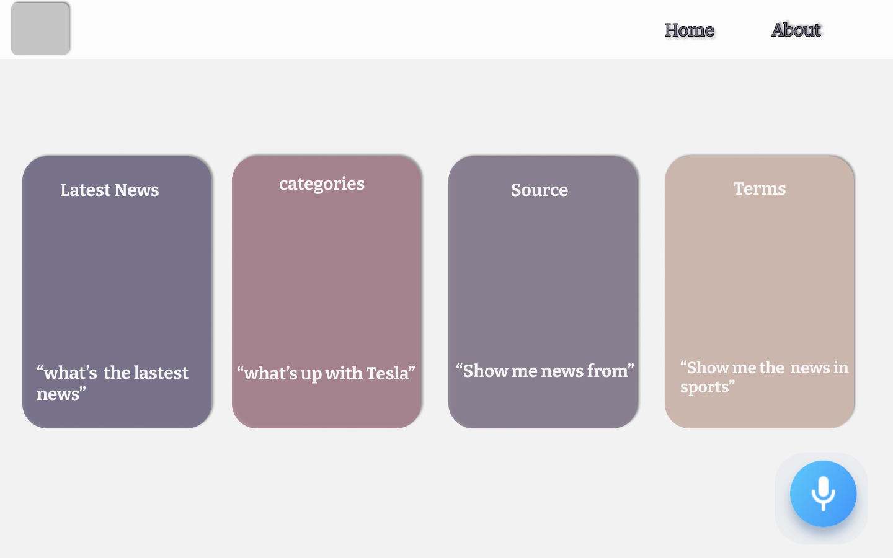
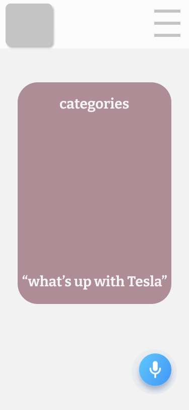
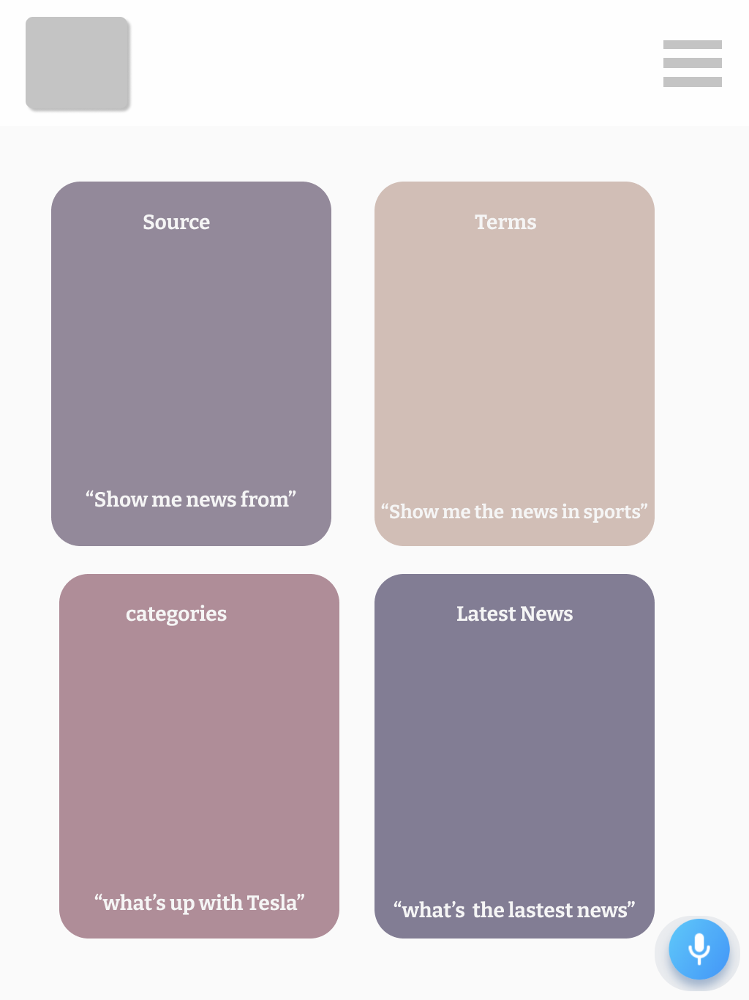

# SPK

## 〰️ What is SPK 〰️

Spk, is a voice controlled News application using Alan AI. Alan's API can request data from news api. Then with the information from News API the Alan API can give you what ever you ask for regarding the news and the user controls everything in the app using their voice. the app is extremely easy to integrate and the goal of the app is the give the user a easy experience of receiving information.

## Examples on how to use SPK

- " _Can you tell me the top stories from CNN"_
- **SPK** Can also read out articles if avalible

## Usage of API ✔️

| API      | Description                                                                    |
| -------- | ------------------------------------------------------------------------------ |
| Alan     | Use of speech recognition allows user to add voice capabilities to application |
| News API | provides all news data with different endpoints                                |

## 📱 How SPKR works 📱:

> - Installing Alan SDK to local machine, using the News API for the Alan's backend interface
> - Alan api will send for a request of data from News API.
> - Alan api will call on one of the various endpoints from News API
> - Alan then provides results the user is looking fo

## 🤳🏽 Preview of SPKR 🤳🏽

| Desktop                                                     |                           Mobile                            |                                                      Tablet |
| :---------------------------------------------------------- | :---------------------------------------------------------: | ----------------------------------------------------------: |
|  |  |  |

## 🛠 Webpage / App Build 🛠

### WireFrame:

_program used - Figma_

- prototype for Webpage
- prototype for mobile
- prototype for tablet

### Requirements ✔️

_mandatory requirements_ that make up the SPK App are

- HTML
- CSS
- JAVASCRIPT
- API
- SDK

## ⚡️ Installation ⚡️

```zsh
yarn init
```

```zsh
yarn add parcel-bundler --dev
```

```zsh
Yarn add axios dotenv
```

```zsh
npm install @alan-ai/alan-sdk-web --save
```

## Usage

```javascript
import axios from "axios";
import dotenv from "dotenv";
import alanBtn from "@alan-ai/alan-sdk-web";
dotenv.config();
```

## 🖇 Additional 🖇:

- Using a second API, News API
- Installing Alan SDK

## Contact 📲

| **Ayman**                                                                                                                                                                                                                                                                                                                                                           | **Jennifer**                                                                                                                                                                                                                                                                                                                                                                 |
| ------------------------------------------------------------------------------------------------------------------------------------------------------------------------------------------------------------------------------------------------------------------------------------------------------------------------------------------------------------------- | ---------------------------------------------------------------------------------------------------------------------------------------------------------------------------------------------------------------------------------------------------------------------------------------------------------------------------------------------------------------------------- |
| <a href="https://www.linkedin.com/in/ayman-omer-b2429b1ab"></a> <a href="https://github.com/aymanjebril2"></a> | <a href="https://www.linkedin.com/in/jennifer-smith-14a8361b7/"></a> <a href="https://github.com/JenniferSmith007"></a> |
