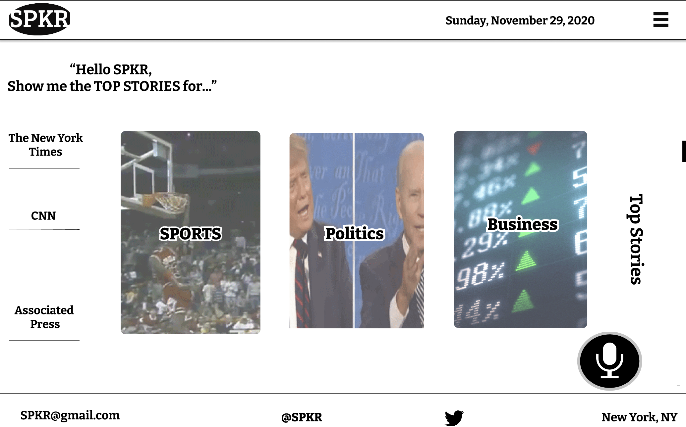
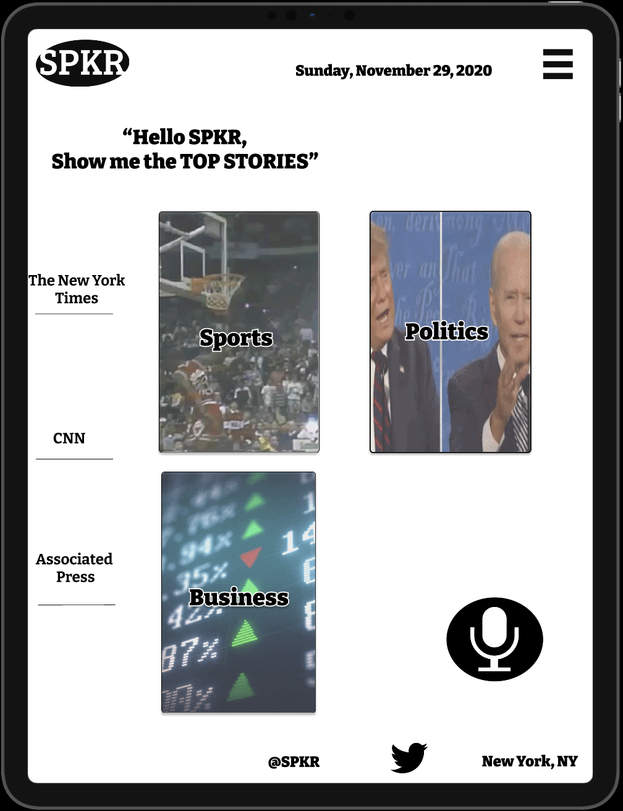

# SPKR
## What is SPKR 
**SPKR** Is a webpage/app that works with voice commands:
- **SPKR** Can you tell me the top stories from CNN
 **SPKR** Can also read out articles if avalible 
 
 ## How SPKR works:
 when a user says a command the alan api will then call on one of the various endpoints to show the results the user is looking for 
 the alan api then sends out a request for data from another api. 
 
 

| Desktop      | Mobile         |Tablet         |
| :---         |     :---:      |          ---: |
|  |    |     |


 ## Procces of Webpage/app buildout 
 
  ### WireFrame:
  *program used - Figma*
   - prototype for Webpage 
   - prototype for mobile 
   - prototype for tablet 
   
   ### Languages Used 
   *Program used - VS CODE*
   - HTML 
   - CSS
   -JAVASCRIPT
   
## Installation
```zsh
yarn init
```
```zsh
yarn add parcel-bundler --dev
```
```zsh
Yarn add axios dotenv
```
```zsh
npm install @alan-ai/alan-sdk-web --save
```
 
## Contact
| Name | Contact |
| --- | --- |
| **Ayman** | <a href="https://www.linkedin.com/in/ayman-omer-b2429b1ab"></a> |
| **Jennifer** | <a href="https://www.linkedin.com/in/jennifer-smith-14a8361b7/"></a> |


[](https://www.linkedin.com/in/ayman-omer-b2429b1ab)
