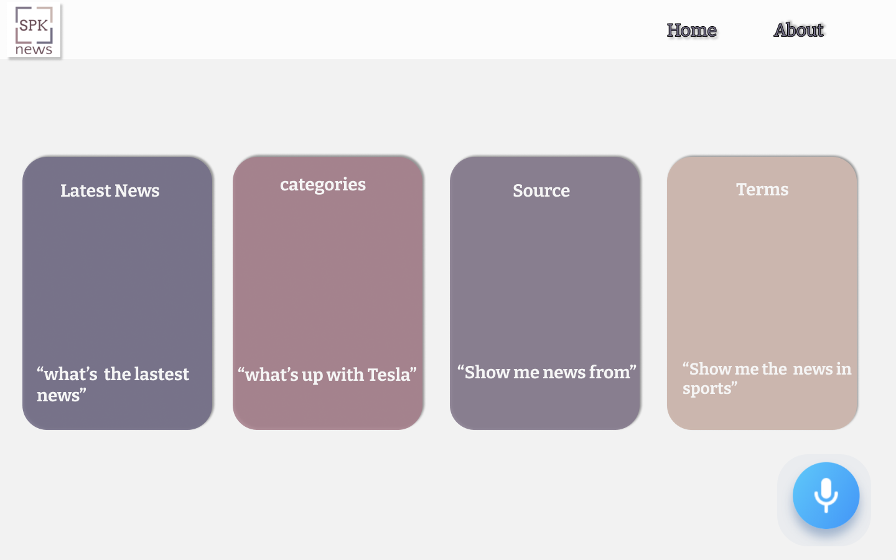
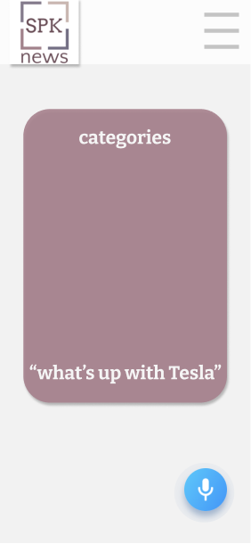
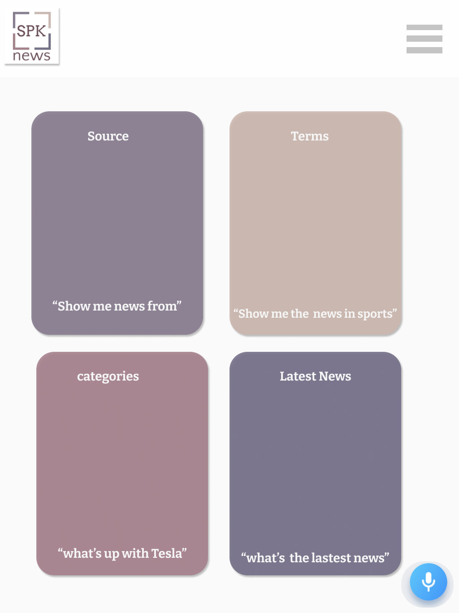

# 

## 〰️ What is SPK 〰️

_Spk_. Is a _voice controlled_ News application using _Alan AI_. Alan's API can request data from _News API_. Then with the information from News API the Alan API can give you what ever you ask for regarding the news and the _user controls everything_ in the app using their _voice_. the app is extremely easy to integrate and the goal of the app is the give the user a _easy experience_ of receiving information.

## Examples on how to use SPK

- " _Can you tell me the top stories from CNN"_
- **SPK** Can also read out articles if avalible

## Usage of API ✔️

| API      | Description                                                                    |
| -------- | ------------------------------------------------------------------------------ |
| Alan     | Use of speech recognition allows user to add voice capabilities to application |
| News API | provides all news data with different endpoints                                |

## 📱 How SPK works 📱

> - Installing Alan SDK to local machine, using the News API for the Alan's backend interface
> - Alan api will send for a request of data from News API.
> - Alan api will call on one of the various endpoints from News API
> - Alan then provides results the user is looking fo

## 🤳🏽 Preview of SPK 🤳🏽

| Desktop                                                       |                            Mobile                             |                                                        Tablet |
| :------------------------------------------------------------ | :-----------------------------------------------------------: | ------------------------------------------------------------: |
|  |  |  |

## 🛠 Webpage / App Build 🛠

### WireFrame

_program used - Figma_

- prototype for Webpage
- prototype for mobile
- prototype for tablet

### Requirements ✔️

_mandatory requirements_ that make up the SPK App are

- HTML
- CSS
- JAVASCRIPT
- API

## ⚡️ Installation ⚡️

```zsh
yarn init
```

```zsh
yarn add parcel-bundler --dev
```

```zsh
Yarn add axios dotenv
```

```zsh
npm install @alan-ai/alan-sdk-web --save
```

## Usage

```javascript
import axios from "axios";
import dotenv from "dotenv";
import alanBtn from "@alan-ai/alan-sdk-web";
dotenv.config();
```

## 🖇 Additional 🖇

- Using a second API, News API
- Installing Alan SDK

## Contact 📲

| **Ayman**                                                                                                                                                                                                                                                                                                                                                           | **Jennifer**                                                                                                                                                                                                                                                                                                                                                                 |
| ------------------------------------------------------------------------------------------------------------------------------------------------------------------------------------------------------------------------------------------------------------------------------------------------------------------------------------------------------------------- | ---------------------------------------------------------------------------------------------------------------------------------------------------------------------------------------------------------------------------------------------------------------------------------------------------------------------------------------------------------------------------- |
| <a href="https://www.linkedin.com/in/ayman-omer-b2429b1ab"></a> <a href="https://github.com/aymanjebril2"></a> | <a href="https://www.linkedin.com/in/jennifer-smith-14a8361b7/"></a> <a href="https://github.com/JenniferSmith007"></a> |
